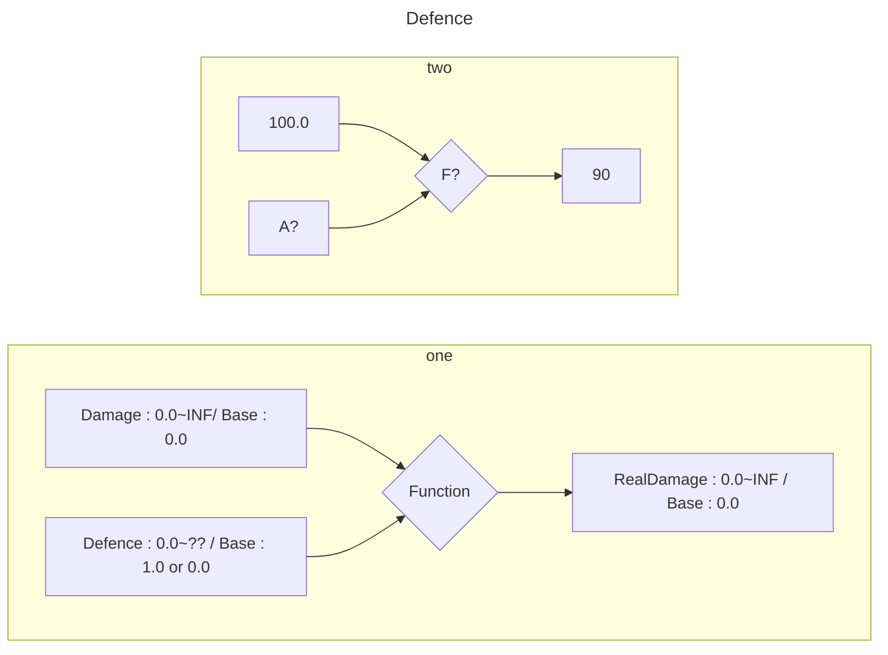
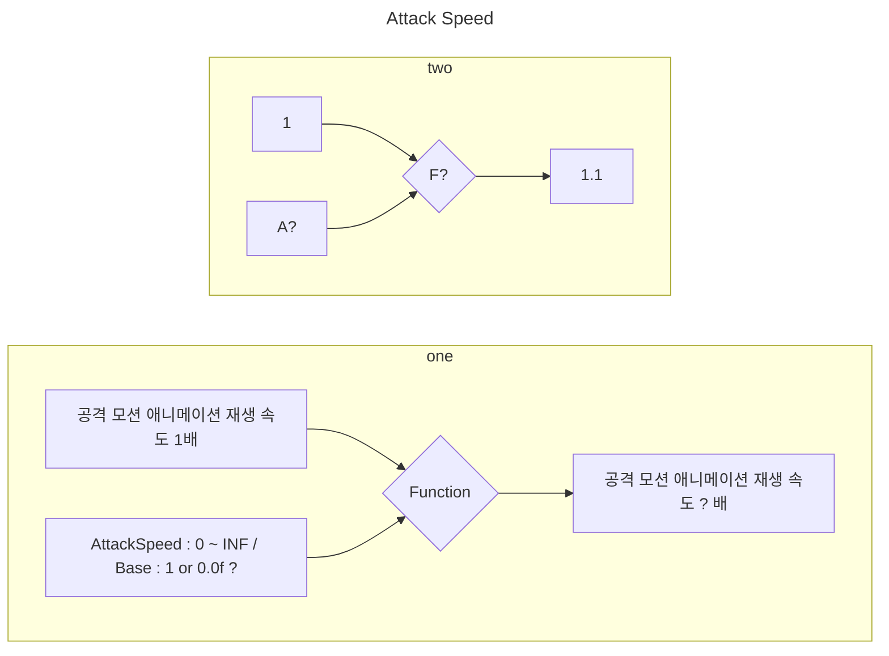
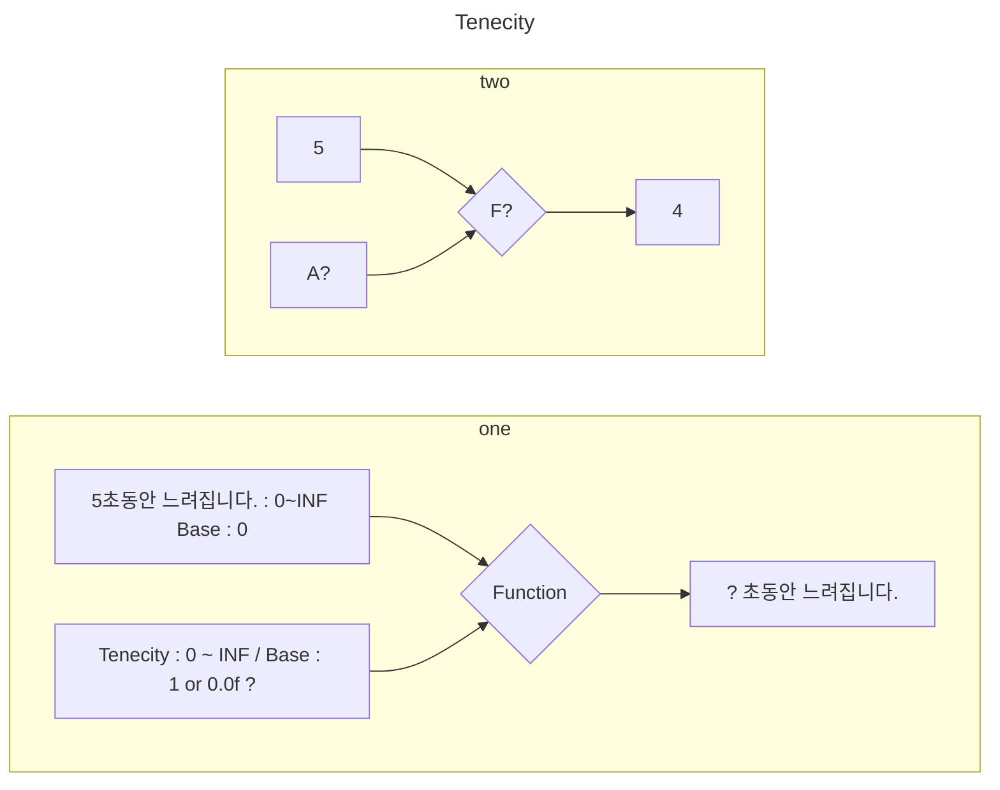

### Defence
데미지 10퍼센트 감소하여 들어온다.



### AttackSpeed

1. 공격속도는 10% 증가한다.
2. 애니메이션의 재생 속도 : 1.1배, 2면 2배가 될예정
    * 근접 공격속도는 애니메이션 재생 속도를 배속으로 
    * 원거리 공격속도는 1초당 투사체가 생산되는 속도를 배속으로 



### Tenacity
상태이상 저항력 
5초의 독데미지가 있다할때, 1초 감소하려면?



```mermaid
---
title: Animal example
---

classDiagram

```