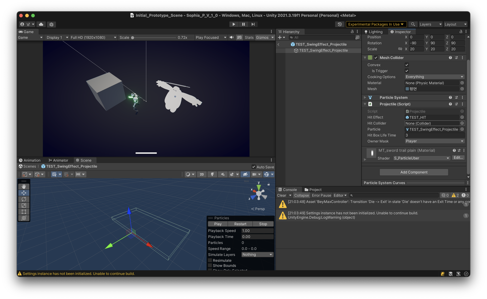

### Collision 세팅

> 발생한 문제 : 키네마틱 설정을 키면 OnCollider OnTrigger이 인식이 안되는 오류가 있다.

**① Projectile**
<div align=center>
    <br>
    Projectile의 설정은 다음과 같다.
</div>

**② 키네마틱 세팅을 키면 트리거 엔터가 활성화 되지 을때**

<div align=center>
    <br>
    Edit -> Project Setting -> Physics
</div>

**③ 대충 작동 안했던 코드**

*
    ```cs
    using System;
    using System.Collections;
    using System.Collections.Generic;
    using UnityEngine;
    using UnityEngine.Events;
    using Newtonsoft.Json;
    using Newtonsoft.Json.Linq;

    public class Projectile : MonoBehaviour {
        public GameObject HitEffect;
        public Collider HitCollider;
        public ParticleSystem Particle;
        public float HitBoxLifeTime;
        public Dictionary<Affector_PlayerState ,IModifier> Modifiers;

        public LayerMask ownerMask;
        //private void OnCollisionEnter(Collision other) "Collision"
        //private void OnTriggerEnter(Collider other)    "Collider"
        // 이 코드가 붙어있는 콜라이더 컴포넌트가 IsTrigger이 되야 작동 하는것
        private void OnTriggerEnter(Collider other) {
            if(ownerMask.value == other.gameObject.layer) {return;}
            Debug.Log($"{other.gameObject.name}, Collider Trigger");
            other.gameObject.TryGetComponent<IDamagable>(out IDamagable damagebleEntity);
            other.gameObject.TryGetComponent<IAffectable>(out IAffectable affectableEntity);
            damagebleEntity.GetDamaged(5);
            affectableEntity.AsyncAffectHandler(this.affectorType,new PoisonState(damagebleEntity).AsyncAffectorCoroutine);
        }
    }
    ```

**④ 참고**

* https://answers.unity.com/questions/209656/having-a-kinematic-rigidbody-detect-collision-with.html

* https://linecode.tistory.com/5

---

### 몬스터의 구조

<div align=center>
    <br>
    Edit -> Project Setting -> Physics
</div>

```txt
몬스터 구조
    몬스터
    ├── 월드스페이스
    │   ├── 모델 : 3D 리소스들을 저장한다
    │   ├── VFXBucket : 파티클, 피격 이펙트의 생성
    │   ├── ProjectileBucket : 투사체 생성지점
    │   └── Bilboard UI : 캐릭터에 표함된 World캔버스
    └── 스크린 스페이스
```

---

### Destroying assets is not permitted to avoid data loss.

> 즉, 니가 삭제하려는 오브젝트가 프리펩이냐? 해서 데이터 안전을 위해 뜨는 오류
> 복사 해놓고 삭제하란다.

**① 프로젝타일 코드 Before & After**

* before
    ```cs
    /*Projectile*/

    public void InstanciateProjectile(GameObject _owner, Quaternion _angle){
        spawnOwner = _owner;
        Instantiate(gameObject, transform.position, _angle);

    }
    public void InstanciateProjectile(GameObject _owner){
        spawnOwner = _owner;
        Instantiate(gameObject, transform);
    }
    ```
* after
    ```cs
    /*Projectile*/
    
    //여기를 통해서 이 스크립트를 실행한 놈을 호출 할 수 있다.
    public GameObject InstanciateProjectile(GameObject _owner, Transform parent){
        spawnOwner = _owner;
        return Instantiate(gameObject, parent.position, parent.rotation);
    }
    ```

**② 프로젝타일 버킷 코드 Before & After**

* before
    ```cs
    /*ProjectileBucket.cs*/

    public void ProjectileInstantiator(Projectile projectile){
        projectile.InstanciateProjectile(gameObject);
        Destroy(projectile, 0.6f);
    }
    ```
* after
    ```cs
    /*ProjectileBucket.cs*/
    
    public void ProjectileInstantiator(Projectile projectile){
        Destroy(projectile.InstanciateProjectile(gameObject, transform), 0.6f);
    }
    ```


https://forum.unity.com/threads/destroying-assets-is-not-permitted-to-avoid-data-loss.1270514/

---

### ScriptableObject Data 사용

> 다음은 스크립터블 오브젝트를 실험하기 위해서 임시로 넣었던 코드였고, 현재는 없다.
> 다음이 설명하는 바는 플라이 웨이트가 되는 객체를 변경 시키지 마라
> 이 데이터를 참조하는 모든 객체에 영향으 끼치기 때문다.

```
/*Sandbag.cs*/
/*
[ContextMenu("GetDamaged", false, int.MaxValue)]
public void GetDamaged(){
    //this.sandbagData.CurHP -= 334;
    CurHP -= 334;
    //this.hpChangedEvent.Invoke();
    //if (this.sandbagData.CurHP <= 0) {Die();}
    if (CurHP <= 0) {Die();}
}
// 공유 되는 데이터 이므로 인스턴스마다 차이나는 값을 지정해서는 안된다.
//private void Update() {
//    if (this.sandbagData.CurHP <= 0){Die();}
//}
*/
```

---

### 메쉬의 위치
블렌더


유니티 


---

### DynamicsArchtecture

플레이어, 몬스터와 같은 Entity의 동작은 인터페이스를 통해 소통하도록 한다.

디버프의 사용법
```cs
private void OnTriggerEnter(Collider other) {
    //인터페이스를 구현한 객체를 받는다.
    IDamagable damagebleEntity = other.gameObject.GetComponent<IDamagable>();
    IAffectable affectableEntity = other.gameObject.
    GetComponent<IAffectable>();

    //전달 하기
    damagebleEntity.GetDamaged(_amount: 5, HitEffect);
    //디버프는 new를 사용하여 생성하고,
    //AsyncAffectorCoroutine에 그 효과(매소드)가 담겨 있다.
    //IAffectable는 AsyncAffectorCoroutine을 처리하는 인터페이스다. 
    affectableEntity.AsyncAffectHandler(this.affectorType,new PoisonState(other.gameObject).AsyncAffectorCoroutine);
}
```

```cs
//생성자에 이 함수가 실행될 대상을 넣어 준다
PoisonState poison = new PoisonState(other.gameObject);
affectableEntity.AsyncAffectHandler(this.affectorType,poison.AsyncAffectorCoroutine);
```

---

### Pipeline
앞으로 파이프라인이란,
몬스터와 플레이어, 플레이ㄴ어와 무기, 플레이어와 부품 등등
각기 다른것들과 데이터 통신을 위한 클래스가 될것이다.

모든 능력치 변화는 무조건 파이프라인과의 연산을 통해서 이뤄진다.

### 커스텀 클래스 시리얼라이즈화
A 클래스를 포함하는곳에 A를 인스펙터에 보여지게 하고 싶다면..
```cs
[System.Serializable]
public class A {
    [field : SerializeField] var one;
    [field : SerializeField] var two;
    [field : SerializeField] var three;
    [field : SerializeField] var four;
    ...
}
```

```cs
[field : SerializeField]
A a;
```

사용한 예시


```cs
[System.Serializable]
public class EquipmentAddingData {
    
    [field : SerializeField] public int      MaxHP       {get; set;}
    [field : SerializeField] public int      CurHP       {get; set;}
    [field : SerializeField] public float    MoveSpeed   {get; set;}
    [field : SerializeField] public float    Defence     {get; set;}
    [field : SerializeField] public float    Tenacity    {get; set;}
    [field : SerializeField] public int      MaxStamina  {get; set;}
    [field : SerializeField] public int      CurStamina  {get; set;}
    [field : SerializeField] public float    Power       {get; set;}
    [field : SerializeField] public int      Luck        {get; set;}
    [field : SerializeField] public int      Gear        {get; set;}
    [field : SerializeField] public int      Frag        {get; set;}
    [field : SerializeField] public float    DamageRatio {get; set;}
    [field : SerializeField] public float    WeaponDelay {get; set;}
    [field : SerializeField] public float    Range       {get; set;}
    [field : SerializeField] public int      Ammo        {get; set;}
    public SkillRankInfo[] SkillRankInfos;
```

```cs
using UnityEngine;
using UnityEngine.UI;
using UnityEngine.Events;

[CreateAssetMenu(fileName = "EquipmentAddingData", menuName = "ScriptableObject/Equipment", order = int.MaxValue)]
public class ScriptableObjEquipmentAddingData : ScriptableObject {
    public string equipmentName;
    public string description;
    public Sprite sprite;
    [field : SerializeField]
    EquipmentAddingData EquipmentAddingData;
}
```

### Git Stash 했던 Enemy


[GitStash 에 대한 정보](https://backlog.com/git-tutorial/kr/reference/stash.html)

------------------------------------------------------------------------

### DataClone

[DeepCopy](https://zzang9ha.tistory.com/372)
그런데 사실 유니티에서 DeepCopy란 Instanciate란다..
클래스를 인스턴시에트 하면 된다.

클래스를 인스턴시에이트하면 딱 그것만 생기냐? 댓츠 노노

<div align="center">
	<p>🔻관련 유튜브를 보려면 사진 클릭🔻<p>
	<a href="https://www.youtube.com/watch?v=tyjmddv4f0I"></a>
	<h4>다른컴포넌트로 오브젝트 생성실험</h4>
</div>

프리펩을 Instantiate할때 
GameObject가 아니라 컴포넌트를 통해서도 생성 가능하다.
그런데. 여기서 궁금한것은. 🤔
- case 1 : 컴포넌트로 생성했으면 오직, 그 컴포넌트에 대해서만 생긴다
- case 2 : 분명 다른 컴포넌트를 참조해서 Instantiate 했는데 프리펩 차체가 생긴다. (생성했던 컴포넌트 뿐만 아니라 프리펩을 이루는것 모두가 같이 딸려서)

여기서 어느 케이스가 되는지 궁금해서 실험했다.

☆ 결론 ☆ : case 2
프리펩을 다른 컴포넌트를 참조해서 Instantiate 해도 
프리펩 차체가 생긴다. (생성했던 컴포넌트 뿐만 아니라 프리펩을 이루는것 모두가 같이 딸려서)

이로써, Projectile 컴포넌트를 가지고 있는 프리펩을 만들때, 그걸 이루는 게임오브젝트 자체가 생긴다 ㅎ

------------------------------------------------------------------------

### Destroy(this)

만약 어떤 클래스 내부에서
이 컴포넌트를 가지는 게임오브젝트를 지워볼까 하고 `Destroy(this)` 라고 하면 
진짜 딱, 그 컴포넌트만 삭제된다.

<div align="center">
	<p>🔻관련 유튜브를 보려면 사진 클릭🔻<p>
	<a href="https://www.youtube.com/watch?v=CbTzF9uODp4"></a>
	<h4>컴포넌트 Destroy(this)는 딱, 그 컴포넌트만 삭제한다.</h4>
</div>

만약 어떤 클래스 내부에서
이 컴포넌트를 가지는 게임오브젝트를 지워볼까 하고 `Destroy(this)` 라고 하면 
진짜 딱, 그 컴포넌트만 삭제된다.

그래서 만약 게임 오브젝트가 삭제된건지 아닌지 
nullcheck할때 난감한 상황이 오니 조심하기를

------------------------------------------------------------------------

### RigidBody를 가진 Transform 을 SetParent 할때 생기는 이상한 움직임
결론은 isKinematic가 활성화 되지 않은 RigidBody 때문이다.

해결방법은 다음과 같다
case 1 : RigidBody를 없엔다
case 2 : isKinematic를 활성화 한다

<div align="center">
	<p>🔻관련 유튜브를 보려면 사진 클릭🔻<p>
	<a href="https://www.youtube.com/watch?v=8KMXQvSntGY"></a>
	<h4>컴포넌트 Destroy(this)는 딱, 그 컴포넌트만 삭제한다.</h4>
</div>

------------------------------------------------------------------------

### 코루틴 < UniTask 인 이유를 하나 더 발견함

코루틴의 단점. GameObject로 존재해야지 작동한다는것.
* 만약 스크립트 내에서만 처리하고 싶은데 이가 인스턴시에이트가 안되면
    코루틴은 작동이 안된다.

그래서 처음엔 인스턴시에이트 해서 코루틴 작동 시키려하니.. 이렇게까지 해야하나 싶어서
UniTask를 한번 간만에 꺼내서 써봤다

결과는 인스턴시에이트 안해도 작동이 되는.. 획기적이더라..


### 엔티티 클래스와 이걸 상속 받는 애들